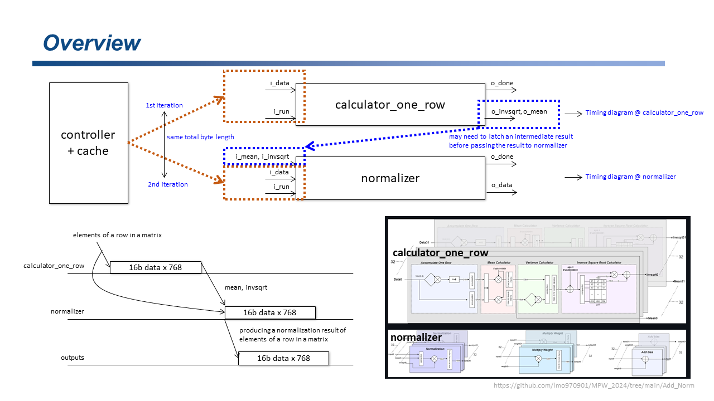
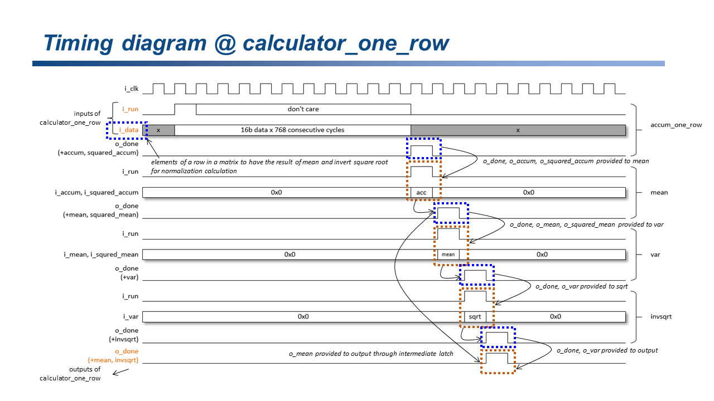
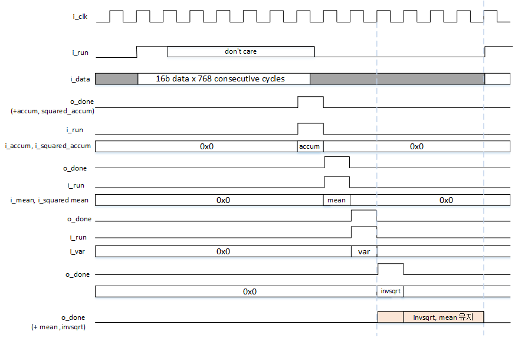
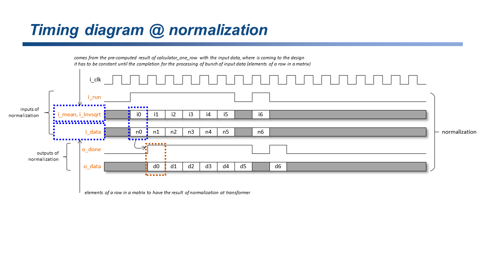

# LayerNorm IP 코어 — HW 스펙

> **AXI wrapper** (레지스터 맵, FSM, 제어 시퀀스) → **[`README_AXI_WRAPPER.md`](README_AXI_WRAPPER.md)** 

> **FPGA이용 SW(pytorch glue task) BERT 모델 실행   / HIL 환경** (Host PC ↔ ZCU111 SW 흐름) → **[`README_FPGA_overview.md`](README_FPGA_overview.md)**

---

## 1. 모듈 구성 및 2-iteration 동작

- LayerNorm 은 두 서브모듈을 2-iteration으로 순차 실행
- valid/ready 핸드셰이크

**ITER1: 각 row의 mean / invsqrt 계산**
- 입력 데이터 : column-first로 **d_model(= feature)번** 전달
- top_calculator_one_row 에서 o_mean, o_invsqrt 출력 (MODULE_NUM 개 row 분량)  

**STORE : o_mean, o_invsqrt 저장**
- **상위 모듈** (ex. axi_wrapper)에서 → o_mean, o_invsqrt 를 외부 레지스터에 저장

**ITER2: normalization 계산**
- ITER1과 **동일** 입력 + 저장된 mean/invsqrt
- 출력 데이터 : column-first로 **d_model(= feature)번** 전달


| 서브모듈 | 역할 |
|----------|------|
| `top_calculator_one_row` | MODULE_NUM 개 row 를 병렬로 처리, row 당 mean·invsqrt 출력 |
| `top_normalization` | MODULE_NUM 개 row 를 병렬 정규화, mean·invsqrt 는 외부에서 주입 |

> **MODULE_NUM** = 한 번에 병렬 처리되는 row(토큰) 수
> k번째 사이클에, MODULE_NUM 개 row 의 동일 feature 열(column k) 이 담김

---


**참고:**
- `layernorm_axi_wrapper` FSM 으로 2-iteration 처리 → [`README_AXI_WRAPPER.md`](README_AXI_WRAPPER.md)

---

## 2. 서브모듈 주요 포트

### top_calculator_one_row

```
입력
  i_clk, i_reset
  i_s_valid                               ← 입력 데이터 valid
  i_data  [DATA_WIDTH×MODULE_NUM - 1 : 0] ← column-first 패킹 데이터
  i_d_model    [10:0]                     ← 런타임: feature 수 (예: 768)
  i_shift_value [4:0]                     ← 런타임: 나눗셈 근사 shift (signed )
  i_mult_value  [7:0]                     ← 런타임: 나눗셈 근사 mult  (signed )

출력
  o_s_ready                               ← 입력 수신 가능
  o_m_valid                               ← mean·invsqrt 계산 완료
  o_mean     [DATA_WIDTH×MODULE_NUM - 1 : 0]
  o_invsqrt  [DATA_WIDTH×MODULE_NUM - 1 : 0]
```

### top_normalization

```
입력
  i_clk, i_reset
  i_s_valid
  i_data     [DATA_WIDTH×MODULE_NUM - 1 : 0]    ← ITER1 과 동일 원본 데이터
  i_mean     [DATA_WIDTH×MODULE_NUM - 1 : 0]    ← ITER1 에서 저장한 mean
  i_invsqrt  [DATA_WIDTH×MODULE_NUM - 1 : 0]    ← ITER1 에서 저장한 invsqrt
  i_m_ready
  i_data_last

출력
  o_s_ready
  o_m_valid
  o_data     [DATA_WIDTH×MODULE_NUM - 1 : 0]    ← norm 결과
  o_data_last
```

---

## 3. 입력 데이터 버스 크기 및 패킹 :  512bit , column-first 패킹
**데이터 => 16bit (8.8 fixed-point)**  
**512bit = 32row * 16bit**
```
512-bit bus (MODULE_NUM=32) :

bits[15:0]   = row0[k]
bits[31:16]  = row1[k]
...
bits[511:496]= row31[k]
```


```
`k`beat (= feature column k) 에 [MODULE_NUM 개 row] 를 묶어 전송:

beat[k].bits[ 16*(r+1)-1 : 16*r ]  =  input[row=r, col=k] (8.8 fixed-point)

```


**참고 : PyTorch 데이터 전처리 (SW 모델에서 변환 필요함)**
1. float32 → int16 (×256)  : 8.8 fixed-point 인코딩
2. row-major → column-first : `chunk.T.flatten()`

```python
# input_chunk : (MODULE_NUM, d_model)  float32
int16_chunk = np.clip(np.round(input_chunk * 256.0), -32768, 32767).astype(np.int16)
flat = int16_chunk.T.flatten()          # column-first 직렬화 → 전송 버퍼
```
수신 후 역변환:
```python
# raw : MODULE_NUM × d_model 개의 int16 (column-first 순)
out = np.frombuffer(raw, dtype=np.int16).astype(np.float32) / 256.0
out_2d = out.reshape(d_model, MODULE_NUM).T   # (MODULE_NUM, d_model)
```

---

## 4. IP 파라미터 (1)

| 파라미터 | 기본값 | 설명 |
|----------|--------|------|
| `MODULE_NUM`             | 32  | 병렬 처리 row 수 = TDATA_WIDTH / DATA_WIDTH |
| `DATA_WIDTH`             | 16  | 입출력 비트폭 (8.8 fixed-point) |
| `C_S00_AXIS_TDATA_WIDTH` | 512 | 데이터 버스 폭 = DATA_WIDTH × MODULE_NUM |
| `d_model`                | 768 | model feature 수 (col) |
| `shift_value`            | 8 | mean 연산시 나눗셈 대신 사용 |
| `mult_value`             | 8'sb01010101 | mean 연산시 나눗셈 대신 사용 |

`x / d_model ≈ (x >>> shift_value) × (mult_value / 256)`

| d_model | shift_value | mult_value (2진수) | hex | 근사 오차 |
|---------|------------|--------------------|----|----------|
| 192     | 6  | `8'sb01010101` | `0x55` | < 0.4 % |
| 384     | 7  | `8'sb01010101` | `0x55` | < 0.4 % |
| **768** | **8**  | **`8'sb01010101`** | **`0x55`** | < 0.4 % |
| 1024    | 10 | `8'sb01000000` | `0x40` | = 0 %   |
| 1280    | 8  | `8'sb00110011` | `0x33` | < 0.2 % |

`mult_value=0x55` = 85/256 ≈ 0.332 (≈ 1/3)  
`mult_value=0x40` = 64/256 = 0.25  
`mult_value=0x33` = 51/256 ≈ 0.199

**d_model, shift_value, mult_value 는 AXI wrapper 사용 시 AXI-Lite 레지스터로 주입**

> AXI wrapper 사용 시 이 값들을 레지스터(slv_reg2, slv_reg3)로 주입하는 방법 →  
> [`README_AXI_WRAPPER.md` — 2. AXI-Lite 레지스터 맵](README_AXI_WRAPPER.md#2-axi-lite-레지스터-맵)

---

## 5. IP 파라미터 (2)
: 내부 레지스 비트폭 (rtl parameter화)

| 단계 | 비트폭 | 포맷 | HW 파라미터 이름 |
|------|--------|------|-----------------|
| 입력 (input) | 16 bit | 8.8 fixed-point | `DATA_WIDTH = 16` |
| x 누적합 | 26 bit | 18.8 | `ACCUM_DATA_WIDTH = 26` |
| x² 누적합 | 34 bit | 26.8 | `SQUARED_ACCUM_DATA_WIDTH = 34` |
| 평균 (mean) | 16 bit | 8.8 | `MEAN_DATA_WIDTH = 16` |
| x² 평균 | 32 bit | 16.16 | `SQUARED_MEAN_DATA_WIDTH = 32` |
| 분산 (var) | 24 bit | 8.16 | `VAR_DATA_WIDTH = 24` |
| invsqrt (LUT 출력) | 16 bit | 8.8 | `LUT_NUM = 24, START_INDEX = 16` |
| 출력 (output) | 16 bit | 8.8 | — |

`eps` = 0.0000152587890625 = 2⁻¹⁶ (16.16 포맷 최소 표현값)

---

## 6. 타이밍 다이어그램 / HW 구조 / function 설명








